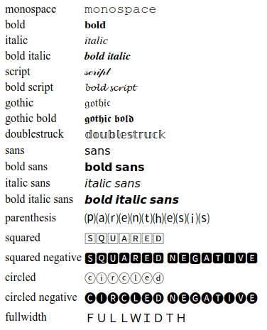
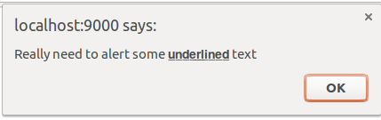

# toUnicodeVariant

Javascript function to convert a string into different kind of **ⓤⓝⓘⓒⓞⓓⓔ** variants. 

#### browser
```html
<script src="path/to/toUnicodeVariant.js"></script>
```
#### nodejs
```javascript
const toUnicodeVariant = require('path/to/toUnicodeVariant.js') 
```
#### usage
```javascript
toUnicodeVariant(string, variant, flags)
...
toUnicodeVariant('monospace', 'm') //like first row below 
```

|Variant     | Alias | Description                   | Example           |
|:--------- |:-----:|:----------------------------- |:----------------- |
| monospace |   m   | Monospace      | 𝚖𝚘𝚗𝚘𝚜𝚙𝚊𝚌𝚎 |
| bold   |   b   | Bold text                        |𝐛𝐨𝐥𝐝  |
| italic  |  i  | Italic text                       | 𝑖𝑡𝑎𝑙𝑖𝑐  |
| bold italic   |   bi   | bold+italic text   | 𝒃𝒐𝒍𝒅 𝒊𝒕𝒂𝒍𝒊𝒄 |
| script     |   c   | Handwriting style         | 𝓈𝒸𝓇𝒾𝓅𝓉    |
| bold script  |  bc   | Bolder handwriting     | 𝓫𝓸𝓵𝓭 𝓼𝓬𝓻𝓲𝓹𝓽      |
| gothic  |   g   |Gothic (fraktur)            | 𝔤𝔬𝔱𝔥𝔦𝔠      |
| gothic bold  |   gb   | Gothic in bold| 𝖌𝖔𝖙𝖍𝖎𝖈 𝖇𝖔𝖑𝖉        |
| doublestruck |   d   | Outlined text        | 𝕕𝕠𝕦𝕓𝕝𝕖𝕤𝕥𝕣𝕦𝕔𝕜 |
| 𝗌𝖺𝗇𝗌   |  s   | Sans-serif style    | 𝗌𝖺𝗇𝗌 |
| bold 𝗌𝖺𝗇𝗌   |  bs   | Bold sans-serif   | 𝗯𝗼𝗹𝗱 𝘀𝗮𝗻𝘀 |
| italic 𝗌𝖺𝗇𝗌   |  is   | Italic sans-serif  | 𝘪𝘵𝘢𝘭𝘪𝘤 𝘴𝘢𝘯𝘴 |
| bold italic sans  |  bis   | Bold italic sans-serif  | 𝙗𝙤𝙡𝙙 𝙞𝙩𝙖𝙡𝙞𝙘 𝙨𝙖𝙣𝙨 |
| circled  |  o   | Letters within circles   | ⓒⓘⓡⓒⓛⓔⓓ |
| circled negative |  on   | -- negative  | 	🅒🅘🅡🅒🅛🅔🅓 |
| squared  |  q   | Letters within squares   | 🅂🅀🅄🄰🅁🄴🄳 |
| squared negative  |  qn   | -- negative  | 🆂🆀🆄🅰🆁🅴🅳
| paranthesis   |  p   | Letters within paranthesis  | ⒫⒜⒭⒠⒩⒯⒣⒠⒮⒤ |
| fullwidth  | w   | Wider monospace font   | ｆｕｌｌｗｉｄｔｈ |


Besides that, the text can be enriched with underline or strike (or both) through the flags param :

```javascript
toUnicodeVariant('gothic', 'g', 'underline')
```
|Variant     | Flags               | Example           |
|:--------- |:-----|:---------------------------- |
| gothic |   underline   | 𝔤̲𝔬̲𝔱̲𝔥̲𝔦̲𝔠̲|
| doublestruck |   strike   | 𝔸̶𝔹̶ℂ̶𝔻̶𝔼̶𝔽̶𝔾̶ℍ̶𝕀̶𝕁̶𝕂̶𝕃̶ |
| sans |   u,s   | 𝟢̶̲𝟣̶̲𝟤̶̲𝟥̶̲𝟦̶̲𝟧̶̲𝟨̶̲𝟩̶̲ |

### Test
Browser: `test/browser.html`
Node: `test$ node node.js`

Those tests show all variants and their coverage a-Z, along with flags. For reference, in Chrome (Ubuntu, 100.0.4896) variants looks like this :<br><br>


#### Expected output
There are really difference between browsers/readers, versions and support of unicode variants. I have not figured it all out yet.  Still "script" is a really
headache. Best browser for supporting both variants and flags are defently Firefox.

### Example

Originally created to show some "cool" styled text in the browsers built-in `alert()`, `prompt()` and `confirm()` dialogs. To show some underlined text in a standard `alert()` box :
```javascript
alert('Really need to alert some '+toUnicodeVariant('underlined', 'bold sans', 'underline')+' text');
```
Would look like this in a browser (here Chrome on older Ubuntu 16.04) :



Note: Most browsers have stopped supporting unicode in their native dialogs!

### Notes

* There is no support for special chars such as `&`, `%` and so on (yet, could be implemented where unicode support it)
* Not all combinations of variants and flags is guaranteed to work. It is try and error. 
* Some variants does not support numbers (or I have missed them) some variants does not support capital or small letters (fixed for some)

Raise an issue if you discover major flaws (or minor flaws as well). You are also more than welcome to suggest other cool unicode variants this function could support.

This work was triggered by the dare need of underlined text in browser dialogs.  The Stack Overflow question [https://stackoverflow.com/questions/17470817/format-the-text-in-javascript-alert-box](https://stackoverflow.com/q/17470817/1407478) pointed me to the right direction, even though none of the answers were actual useable. 

